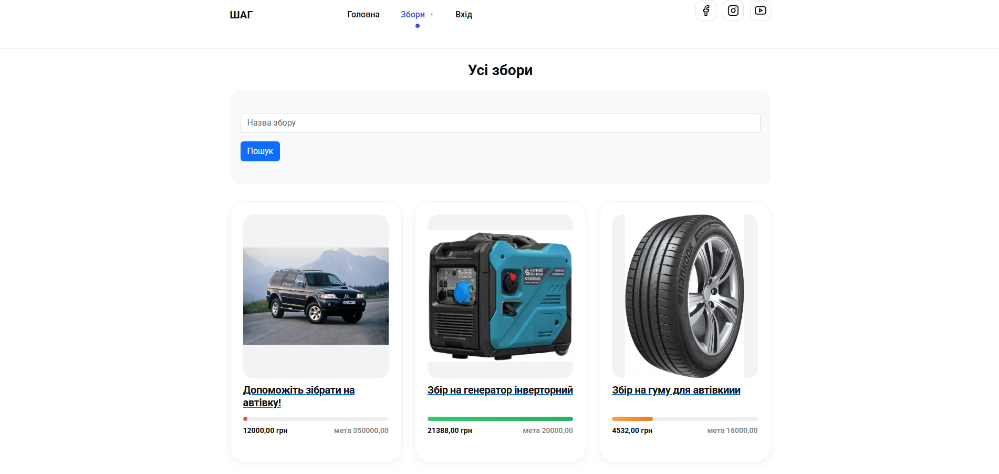
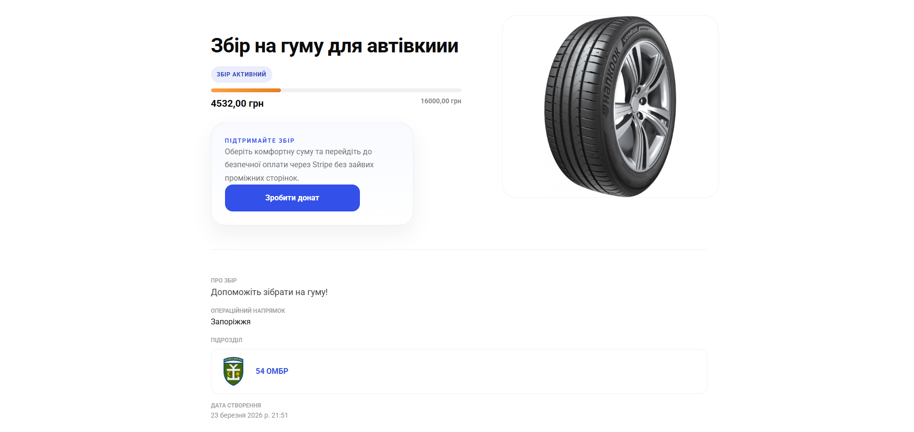
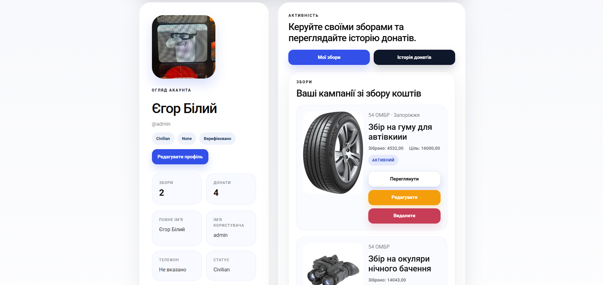

# STEP (ШАГ)

STEP (ШАГ) is a charity platform for supporting Ukrainian military needs. Volunteers and military users can create fundraising campaigns for front-line needs, set monetary goals, collect donations, and publish reports after campaigns are closed.

The project is organized as a Django web application with feature apps for users, fundraisers, donations, verifications, reports, military units, and static landing pages.

## Features

- User registration, login, logout, profile editing, avatars, and role/status metadata.
- Fundraising campaigns for military and volunteer needs with target/current amounts, images, related units, and close/update/delete actions.
- Stripe Checkout donations in UAH with webhook-based payment confirmation.
- Donation history linked to users and fundraising announcements.
- Verification requests with uploaded documents for military, volunteer, or foundation roles.
- Military unit detail pages with hierarchical unit relationships.
- Closing reports with receipt/document and photo uploads after fundraising campaigns are completed.
- Sphinx documentation scaffold and GitHub Actions for tests and linting.

## 📸 Screenshots

<p align="center">
  
  
  
  
  
</p>

## Tech Stack

- Python 3.12+ / 3.13
- Django 6.0.1
- SQLite for local development
- Stripe Python SDK
- django-crispy-forms with Bootstrap 5
- pytest and pytest-django
- Pylint with pylint-django
- Docker and Docker Compose
- Sphinx documentation

## Project Structure

```text
charity_platform/   Django project settings and root URLs
pages/              Home page, shared layout components, static CSS/JS/images
users/              Custom user model, authentication, and profile pages
fundraisers/        Fundraising campaigns and campaign management
donations/          Stripe Checkout sessions, payment records, and webhooks
verifications/      Role verification requests and document uploads
units/              Military unit data and detail pages
reports/            Closing reports for completed fundraisers
tests/              pytest test suite
docs/               Sphinx documentation source and generated build output
media/              Local uploaded files
```

## Environment Variables

Create a `.env` file in the project root for Django and application settings:

```env
DJANGO_SECRET_KEY=replace-with-a-development-secret
STRIPE_SECRET_KEY=sk_test_...
STRIPE_PUBLIC_KEY=pk_test_...
STRIPE_WEBHOOK_SECRET=whsec_...
```

For Docker's optional Stripe CLI service, create `.env.stripe`:

```env
STRIPE_API_KEY=sk_test_...
```

Stripe values are only required when testing real checkout sessions or webhook handling.

## Local Setup

Create and activate a virtual environment:

```powershell
python -m venv .venv
.\.venv\Scripts\Activate.ps1
```

Install dependencies:

```powershell
python -m pip install --upgrade pip
python -m pip install -r requirements.txt
```

Apply database migrations:

```powershell
python manage.py migrate
```

Optionally create an admin user:

```powershell
python manage.py createsuperuser
```

Run the development server:

```powershell
python manage.py runserver
```

Open `http://127.0.0.1:8000/`.

## Docker Setup

Build and run the web application:

```powershell
docker compose up --build web
```

The web container runs migrations automatically before starting Django on `http://127.0.0.1:8000/`.

Run the test service:

```powershell
docker compose --profile test run --rm tests
```

Run the app with Stripe CLI webhook forwarding:

```powershell
docker compose --profile stripe up --build
```

The Stripe CLI forwards events to:

```text
http://web:8000/donations/webhooks/stripe/
```

## Tests and Linting

Run tests locally:

```powershell
pytest
```

Run Pylint with the Django plugin:

```powershell
pylint --load-plugins=pylint_django --django-settings-module=charity_platform.settings charity_platform donations fundraisers pages reports tests units users verifications
```

GitHub Actions runs the test suite on Python 3.12 and 3.13, and runs Pylint on Python 3.13.

## Documentation

The project includes a Sphinx documentation scaffold in `docs/`.

Build HTML documentation:

```powershell
cd docs
.\make.bat html
```